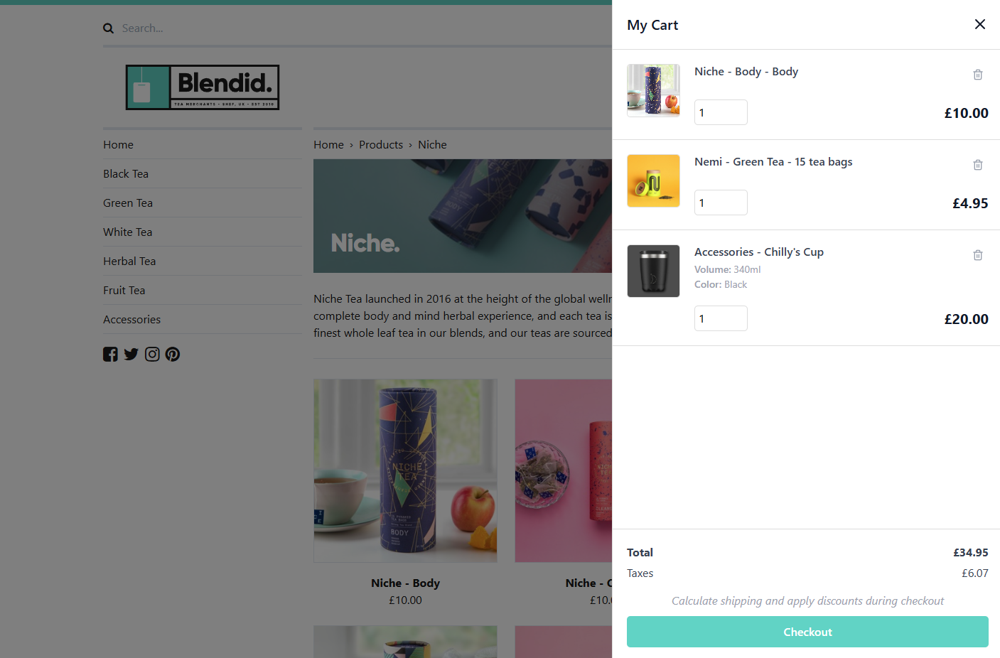

# Umbraco Commerce Cart &middot;  

A ready made shopping cart for Umbraco Commerce

## About

Umbraco Commerce Cart is an add-on package for Umbraco Commerce, providing a drop-in shopping cart solution.

With Umbraco Commerce Cart you can quickly and easily add a ready made, themeable and responsive shopping cart onto your site, saving hours of custom development. 

This package uses the same versioning strategy with Umbraco Commerce. 

## Working locally
To fork and build your own Commerce Cart package, you will need:
* .NET 9.0 SDK or newer
* Umbraco 15.0.0 or newer
* Umbraco Commerce 15.0.0 or newer
* NodeJS 20+ for frontend development. Open `/src/Umbraco.Commerce.Cart/Client` folder and run `npm i; npm run build`

## Raising an Issue

If you find any issues with the Umbraco Commerce Cart add-on itself please raise them in the [issues section of this repository](https://github.com/umbraco/Umbraco.Commerce.Cart/issues)

## License

Copyright © 2025 Umbraco

This demo store is [licensed under MIT](LICENSE.md). The core Umbraco Commerce product is licensed under Umbracos commercial license.

